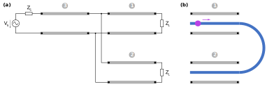
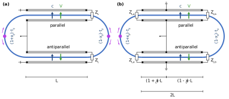

# Electro-optic phase modulation

Flexible python implementation of an analytical approach for modelling electro-optic phase modulation. The method is based on [transmission line theory](https://en.wikipedia.org/wiki/Transmission_line) and is valuable when the spatial and temporal variations of the microwave fields matter:

* Travelling-wave (non-resonant) and resonant modulators. The framework supports electrodes with arbitrary terminations -- open, short-circuited, matched or anything in between.

* Multi-segmental modulators using for example phase-reversal, periodical-loading or ring structures. The [building blocks](#overview-over-building-blocks) for modelling the microwave and optical structures can be flexibly combined.


The module was developed by Samuel Häusler at the [Institute for Sensors and Electronics](https://www.fhnw.ch/en/about-fhnw/schools/school-of-engineering/institutes/institute-for-sensors-and-electronics) of FHNW during the [Bridge project LINIOS (194693)](https://data.snf.ch/grants/grant/194693) of the Swiss National Science Foundation.


## Installation

The package can be installed and updated via the package manager [pip](https://pip.pypa.io) with either of the following commands.

```shell
# install package
pip install git+https://github.com/samuehae/electrooptic.git

# install package with additional dependencies for running examples
pip install git+https://github.com/samuehae/electrooptic.git#egg=electrooptic[examples]
```

The usage of the package is demonstrated with the python scripts included in the folder `examples`.


## Overview over building blocks

The implementation provides microwave and optical building blocks that can interact with each other. For illustrating them, we discuss the exemplary modulation scheme in <a href="#fig-example">Fig. 1</a>.

<figure class="figure">
	
	<figcaption><small>Figure 1: Building blocks. (a) Exemplary microwave circuit with microwave source (voltage V<sub>S</sub>, resistance Z<sub>S</sub>), uniform transmission lines (1, 2 and 3) and terminations (impedance Z<sub>L</sub>). (b) Optical wave packet (purple) travels along optical path (blue) which consists of two modulation segments (1 and 2) and one delay segment (semicircle).
	</small></figcaption>
</figure>


**Microwave blocks**

The *microwave* blocks are depicted in the microwave circuit in <a href="#fig-example">Fig. 1a</a>. The circuit consists of a source and a microwave network built of uniform transmission lines and terminations. They are combined in series and in parallel and therefore the network forms a [tree structure](https://en.wikipedia.org/wiki/Tree_(data_structure)). The following code transparently implements the example circuit.

```python
from electrooptic import microwave

# build the network starting from the terminations
line1 = microwave.UniformTransmissionLine(
	children=[microwave.Termination(z_load)], 
	**parameters
)

line2 = microwave.UniformTransmissionLine(
	children=[microwave.Termination(z_load)], 
	**parameters
)

# connect transmission lines 1 and 2 in parallel
network = microwave.CompositeNetwork([line1, line2])

# create and add transmission line 3 in series
network = microwave.UniformTransmissionLine(
	children=[network], 
	**parameters
)

# create microwave source with given voltage and internal resistance
source = microwave.SourceOpenVoltage(v_source, z_source)

# connect source and network to a circuit
circuit = microwave.Circuit(source, network)
```


**Optical blocks**

<a href="#fig-example">Fig. 1b</a> illustrates an optical wave packet (purple) that travels along an electro-optically active waveguide (blue). In the first segment (1) the presence of the electrodes (transmission line 1) induces an optical phase shift. After the modulation segment (1), the packet experiences a delay segment (semicircle) without phase shift, and then another modulation segment (2). The situation can be conveniently described in code as follows.

```python
from electrooptic import optical

# create empty optical path
optical_path = optical.OpticalPath()

# create and add modulation segment 1
optical_path.add_optical_segment(
	optical.ModulationSegment(microwave_line=line1, **parameters)
)

# create and add delay segment
optical_path.add_optical_segment(
	optical.DelaySegment(t_transit)
)

# create and add modulation segment 2
optical_path.add_optical_segment(
	optical.ModulationSegment(microwave_line=line2, **parameters)
)
```


## Building of common structures

With the [basic blocks](#overview-over-building-blocks) we can build phase modulators componentwise. To simplify building the microwave structure and the optical path, the module `structure` provides methods to construct common modulators.


### Ring modulators

<a href="#fig-ring_structures">Fig. 2</a> depicts two modulation configurations which consist of an optical ring resonator and H-shaped microwave electrodes. The optical wave packet can enter the ring resonator at the locations indicated by a purple circle and then travel in clockwise or anti-clockwise direction. During one round-trip (optical path) the packet experiences delays in the bending sections and phase modulation in the straight sections. The delays in the two bending sections can be different by adjusting the delay asymmetry x<sub>d</sub>. In the symmetric case (x<sub>d</sub>&#160;=&#160;0) the delays are t<sub>d</sub>. In the top and bottom modulation sections the polarity of the electrodes are reversed and thus the fields point in opposite directions (green arrows for positive voltage). At the same time the crystal axis (c) of the electro-optic medium points in both sections upwards.


<figure class="figure">
	
	<figcaption><small>Figure 2: Configurations of ring modulators. The optical wave packet (purple circle) circulates in the ring resonator (blue) and experiences delays in the bend sections and phase modulation in the straight sections. In the bend sections the delays are (1&#160;+&#160;x<sub>d</sub>)&#160;t<sub>d</sub> and (1&#160;-&#160;x<sub>d</sub>)&#160;t<sub>d</sub> with time t<sub>d</sub> in the symmetric case and delay asymmetry x<sub>d</sub>. In the straight sections the crystal axis (c) of the medium is indicated by a blue arrow and the field orientation for positive voltages by a green arrow. The microwaves are injected either (a) at the side or (b) in the middle of the electrodes.
	</small></figcaption>
</figure>


The two configurations differ how the microwaves are delivered to the structure. In <a href="#fig-ring_structures">Fig. 2a</a> the microwaves are injected on one *side* of the electrodes. In <a href="#fig-ring_structures">Fig. 2b</a> they are fed at the middle of the electrodes with a potential asymmetry of the feeding point (feeding asymmetry x<sub>L</sub>). These configurations can be built with the objects `structure.HStructureSideFeeding` and `structure.HStructureMiddleFeeding`. 
